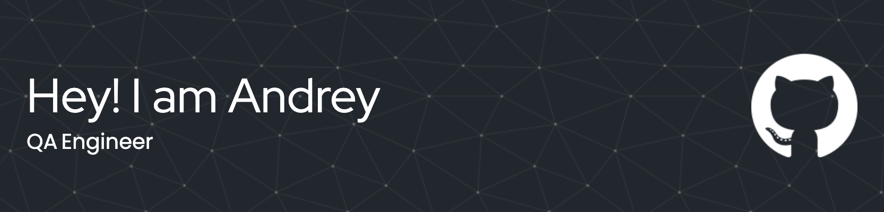

 
 

## Languages, Technologies and Tools
 

	<code></code>
	<code></code>
	<code></code>
	<code></code>
	<code></code>
	<code></code>
	<code></code>

 

	<code></code>
	<code></code>
	<code></code>
	<code></code>
	<code></code>
	<code></code>
	<code></code>

 

## Achievements
 

<code></code>

 

### My Statistics

  

### My Visits

### You can reach out to me

  
  

 

