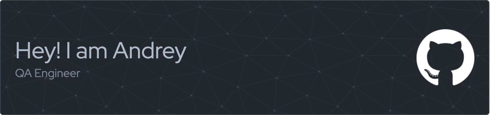

 

## Skills
 

    &nbsp;
    &nbsp;
    &nbsp;
    &nbsp;
    
    
    

 

	&nbsp;
	&nbsp;
	
    
    
    

 

    &nbsp;
    
    
    
    
    

 

  

 

  

 

    &nbsp;
    &nbsp;
    &nbsp;

## Achievements
 

 

## Statistics
 

 

  

## Visits
 

